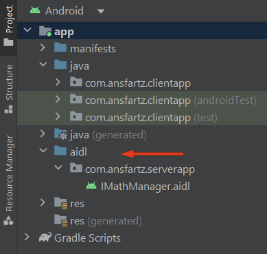

# AIDL-Server-Client

#### [Android Interface Definition Language (AIDL)](https://developer.android.com/guide/components/aidl)

Simple Proof-of-Concept ilustrating 2 applications (a server and a client) communicating using IPC -interprocess communication-, by using an [AIDL](https://developer.android.com/guide/components/aidl) interface.   

This is essentially a "Super Basic AIDL For Dummies" project build for myself to grasp AIDL concepts easier and have a quick reference for later. It is a over simplified version of [Defining an AIDL interface](https://developer.android.com/guide/components/aidl#Defining) with less information and more step-by-step instructions. 

___

Let's assume that the Server App contains some methods which do calculations. We want the Client App to communicate with the Server App so that it too may call these methods with it's own parameter. In order to do that, the Server has to expose these methods in the form of an interface (or API) that the client must know about. This is where AIDL comes in handy. Using an AIDL file, the 2 apps (or rather **processes**) can agree upon the API they'll use to communicate.

We'll essentially follow these steps:   
   1. Server App - Create an AIDL interface. The interface's abstract methods will be called by the Client App to communicate with the Server App. This interface needs to be made available to the Client App.
   2. Server App - Implement the AIDL interface's methods in a new class. Whatever methods the Server App wants to expose, they should be added in the AIDL interface and then implemented accordingly. 
   3. Server App - Create a Service for the Client App to bind to. The method [onBind(intent: Intent?): IBinder](https://developer.android.com/reference/android/app/Service#onBind(android.content.Intent)) will return the implementation of the AIDL interface created in step 2.
   4. Client App - After including the shared AIDL interface in the Client App, connect to the Server App's service and use the IBinder? received from [onServiceConnected(ComponentName?, IBinder?)](https://developer.android.com/reference/android/content/ServiceConnection#onServiceConnected(android.content.ComponentName,%20android.os.IBinder)) to hold a reference to the AIDL interface's implementation (returned in step 3).

___

# AIDLServer
### 1.  The .aidl file

In the Project Tree of the Server App, right click on `app > New > AIDL > AIDL File`. Name it IMathManager, and create its methods (see [docs](https://developer.android.com/guide/components/aidl#Create) for syntax, data types, return values, et al.). 
```java
interface IMathManager {
    int add(in int x, in int y);
    int substract(in int x, in int y);
}
```
Now, build the project `Build > Make Project` to generate the Java interface of IMathManager. After building, in you should have a **java *(generated)*** folder with the IMathManager interface.   

Since it was generated by the Android framework, we won't be modifying anything here (feel free to reformat the file via `CTRL+ALT+SHIFT+L` to make it slightly more readable, but know that any changes here will be lost when the file is regenerated).   

Notice the contents of the IMathManager interface. First there is the Default empty implementation of IMathManager    
More importantly though, there is the Stub class `public static abstract class Stub extends Binder implements IMathManager`. Let's take a quick look at some methods:   
- `public IMathManager asInterface(IBinder)` - this will be called by the Client, to cast the IBinder object received in [onServiceConnected(ComponentName?, IBinder?)](https://developer.android.com/reference/android/content/ServiceConnection#onServiceConnected(android.content.ComponentName,%20android.os.IBinder)) to IMathManager.
- `public boolean onTransact(...)` - overriden from Binder class, this method essentially figures out which methods of IMathManager to call, based on the parameters received via the remote call, in this case from the Client. Explaining how this happens is outside the scope of this PoC.

### 2. The .aidl file's implementation

Let's create the actual implementation of the IMathManager.aidl file. To do this, we'll have to extend the Stub class (NOTE: notice that Stub extends Binder). This is as simple as implementing a normal interface with the 2 methods `add(int x, int y)` and `substract(int x, int y)`. We'll call it `MathManagerImpl`:
```kotlin
package com.ansfartz.serverapp

import java.io.IOException

class MathManagerImpl : IMathManager.Stub(){

    @Throws(IOException::class)
    override fun add(a: Int, b: Int): Int {
        return a + b
    }

    @Throws(IOException::class)
    override fun substract(a: Int, b: Int): Int {
        return a - b
    }
}
```

### 3.  The Service which Client Apps can bind to 

Create a new class extending Service, we'll call it MathService. Since it's a [Service](https://developer.android.com/reference/android/app/Service) it has to override the method ```IBinder onBind(Intent intent)```. This is where we return the Binder (!) MathManagerImpl.

```kotlin
package com.ansfartz.serverapp

import android.app.Service
import android.content.Intent
import android.os.IBinder
import android.util.Log

class MathService : Service() {

    private val mathManagerImpl = MathManagerImpl()

    override fun onCreate() {
        Log.d("MathService", "onCreate:")
        super.onCreate()
    }

    override fun onBind(intent: Intent?): IBinder {
        Log.d("MathService", "onBind: intent: getPackage = ${intent!!.`package`} " +
                "getAction = ${intent.action} " +
                "getData = ${intent.data} " +
                "getComponent = ${intent.component} " +
                "getScheme = ${intent.scheme} " +
                "getDataString = ${intent.dataString}"
        )

        return mathManagerImpl
    }

    override fun onDestroy() {
        Log.d("MathService", "onCreate:")
        super.onDestroy()
    }
}
```

### 3.1  Add the Service to the AndroidManifest.xml

This is a requirement for any Service. See [Declaring a service in the manifest](https://developer.android.com/guide/components/services#Declaring) for more details. Also declare an intent filter with a unique name to specify the action that the Service will receive / accept. 

```xml
<?xml version="1.0" encoding="utf-8"?> 
<manifest xmlns:android="http://schemas.android.com/apk/res/android" package="com.ansfartz.serverapp">

    <application
        android:allowBackup="true"
        android:dataExtractionRules="@xml/data_extraction_rules"
        android:fullBackupContent="@xml/backup_rules"
        android:icon="@mipmap/ic_launcher"
        android:label="@string/app_name"
        android:supportsRtl="true"
        android:theme="@style/Theme.ServerApp">

        <service
            android:name="com.ansfartz.serverapp.MathService"
            android:enabled="true"
            android:exported="true">

            <!-- Intent filter, the Client app will use this action in its Intent -->
            <intent-filter>
                <action android:name="com.ansfartz.service.AIDL"/>
                <category android:name="android.intent.category.DEFAULT"/>
            </intent-filter>
        </service>

        <activity
            android:name=".MainActivity"
            android:exported="true">
            <intent-filter>
                <action android:name="android.intent.action.MAIN" />
                <category android:name="android.intent.category.LAUNCHER" />
            </intent-filter>
        </activity>
       
    </application>

</manifest>    
```

And that's it for the Server App. Feel free to install it on the device and if you want, give it a UI mockup and test the MathManagerImpl. All that's left now is to create the Client App and see that it can call the methods implemented in MathManagerImpl.

# AIDLClient
### 1.  The .aidl file

The .aidl file must have the same package name as the one on the server. Even though the client app's package name is `com.ansfartz.clientapp`, the .aidl file's path must be the same one as the one declared on the Server App, which is ```com.asfartz.aidlserver```.

> Also, it's very important that in production use-cases (i.e. published apps) the .aidl file maintains backwards compatibility with previous versions, to avoid breaking apps that use a previous unupdated version of it.

You can switch to `Project View` on the Server App, copy the `aidl` folder and paste it in the same location in the Client App. Or just follow the same steps as before for creating a new AIDL File (`app > New > AIDL > AIDL File`) but remember to rename the package to have the same one as the Server App. You should end up with this:



`ClientApp\app\src\main\aidl\com\ansfartz\serverapp\IMathManager.aidl`


### 2. Creating a ServiceConnection object

A ServiceConnection is an interface class used for monitoring the connection-relates states of a Service. It has 2 methods that must be implemented:   

> onServiceConnected(ComponentName name, IBinder service)   
  onServiceDisconnected(ComponentName name) 

The first method will be called when the Client App succesfully connect to the Server App's Service. This is where we will initialize the IMathManager object (whose implementation the Client App doesn't know of) by using the IBinder parameter.

```kotlin
private var mathManager: IMathManager? = null

private val serviceConnection: ServiceConnection = object : ServiceConnection {

        override fun onServiceConnected(name: ComponentName?, service: IBinder?) {
            mathManager = IMathManager.Stub.asInterface(service)
            
            isServiceConnected = true
            updateConnectionStatusIcons(connected = true)
        }

        override fun onServiceDisconnected(name: ComponentName?) {
            isServiceConnected = false
            updateConnectionStatusIcons(connected = false)
        }

    }
```
We'll later be using this initialized variable ```mathManager``` to call the remote methods.

### 3. Binding to the Service

To bind to the Server App's service, the Service App (Where the Service is located) must be installed on the device. Then, the Client App only needs to call bind with the appropriate Intent, and the previously declared `serviceConnection`.

```kotlin
var intent = Intent("com.ansfartz.service.AIDL")
intent.component = ComponentName("com.ansfartz.serverapp", "com.ansfartz.serverapp.MathService")

bindService(intent, serviceConnection, BIND_AUTO_CREATE)
```

> Note: You must use an explicit Intent! To do that, you must set the Intent's action and component name:

Option 1 - Shorter, less safe version
```kotlin
var intent = Intent("com.ansfartz.service.AIDL")
intent.component = ComponentName("com.ansfartz.serverapp", "com.ansfartz.serverapp.MathService")
```

Option 2 - Longer, safer version, requires API level 33 to have access to `PackageManager.ResolveInfoFlags`
```kotlin
private fun implicitToExplicitIntent(intent: Intent): Intent? {
    val resolveInfoList: List<ResolveInfo> = packageManager.queryIntentServices(
        intent,
        PackageManager.ResolveInfoFlags.of(
            PackageManager.MATCH_DEFAULT_ONLY.toLong()
        )
    )
    if (resolveInfoList.size != 1) {
        return intent
    }
    val serviceInfo = resolveInfoList[0]
    val component = ComponentName(serviceInfo.serviceInfo.packageName, serviceInfo.serviceInfo.name)
    val explicitIntent = Intent(intent)
    explicitIntent.component = component
    return explicitIntent
}


var intent = Intent("com.ansfartz.service.AIDL")
intent = implicitToExplicitIntent(intent)!!

```

### 4. One last thing

If you're app is targeting Android 11 (API level 30) and up, the Client App won't be able to access the Service from the Server App, because it won't be aware of the Server App being installed at all. This is caused by a privacy update starting with Android 11: apps by default no longer have full visibility over which packages are installed on the device.   

To tell the system that the Client App needs to interact with the Server App, you must add the Server App's package name in the Client App's manifest file, using the `<queries>` element. Simply add the following lines in the Client App's AndroidManifest.xml, outside the <application> tag.   

```xml
<?xml version="1.0" encoding="utf-8"?>
<manifest xmlns:android="http://schemas.android.com/apk/res/android"
    package="com.ansfartz.clientapp">

    <!-- Package visibility filtering - required for apps targeting Android 11 (API level 30) -->
    <!-- See https://developer.android.com/training/package-visibility -->
    <queries>
        <!-- Specific apps you interact with, eg: -->
        <package android:name="com.ansfartz.serverapp" />
    </queries>

    <application
        android:allowBackup="true"
        android:dataExtractionRules="@xml/data_extraction_rules"
        android:fullBackupContent="@xml/backup_rules"
        android:icon="@mipmap/ic_launcher"
        android:label="@string/app_name"
        android:supportsRtl="true"
        android:theme="@style/Theme.ClientApp">
        <activity
            android:name=".MainActivity"
            android:exported="true">
            <intent-filter>
                <action android:name="android.intent.action.MAIN" />

                <category android:name="android.intent.category.LAUNCHER" />
            </intent-filter>
        </activity>
    </application>

</manifest>

```

To read more on this, see:   
- [Package visibility filtering on Android](https://developer.android.com/training/package-visibility)
- [Package visibility in Android 11](https://medium.com/androiddevelopers/package-visibility-in-android-11-cc857f221cd9)   

____

There you have it; a very simple AIDL Server-Client example. I hope this serves you as a rough starting point on what AIDL is and how to use it. Happy coding!
